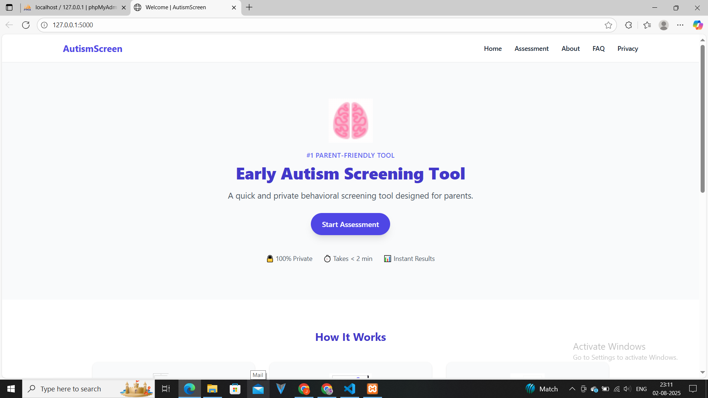
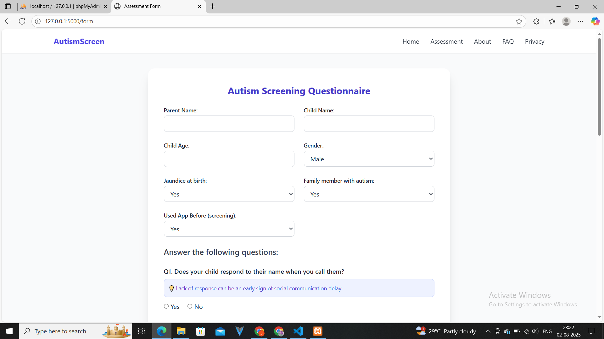
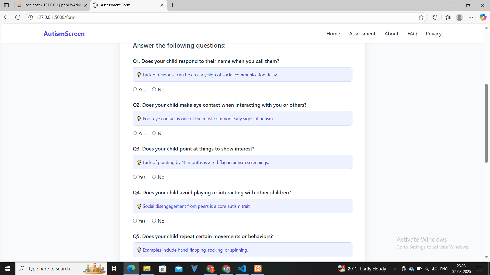
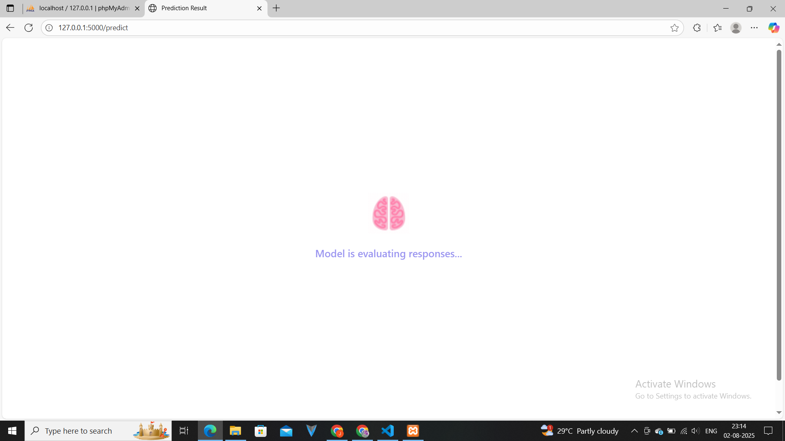
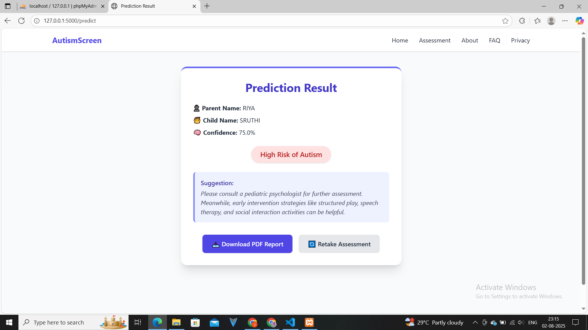
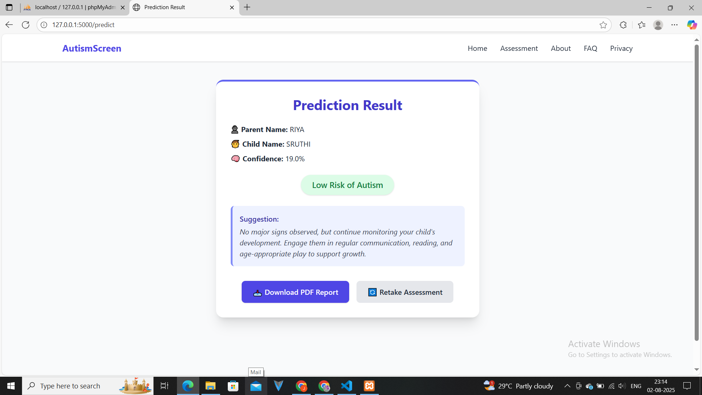
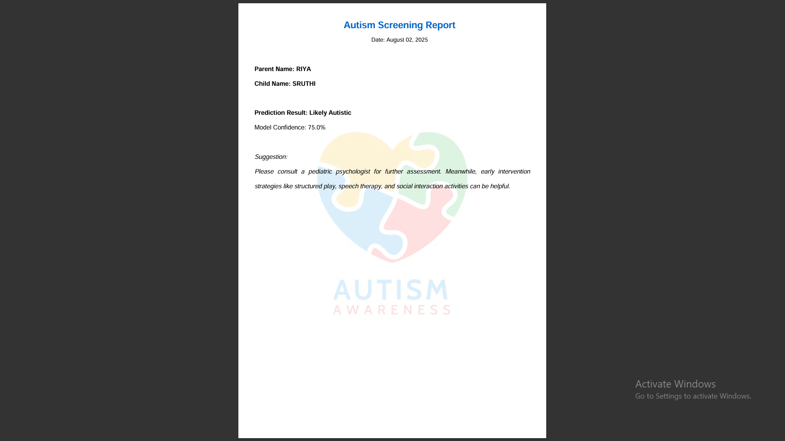

# Autism Screening Web Application

This project is a web-based application designed to assist in the preliminary screening of Autism Spectrum Disorder (ASD) in children. The application collects user responses to a standard questionnaire and uses a machine learning model to provide insights based on the inputs.

## Features

- Web form to input responses to the autism screening questionnaire
- Stores user responses securely
- Predicts the likelihood of autism using a trained ML model
- Provides suggestions or next steps for parents or caregivers


## Technologies Used

- Frontend: HTML, CSS
- Backend: Flask,Python
- Machine Learning: Python, Scikit-learn
- Deployment: XAMPP / Localhost

## How to Run the Project

1. Clone the repository:
   ```bash
   git clone https://github.com/your-username/autism-screening-app.git
## 📸 Project Screenshots

### 🏠 Home Page


### 📝 Questionnaire Page


### ✅ Submission Confirmation


### 📊 Prediction Result


### 👨‍👩‍👧 Caregiver Suggestions


### 🔐 Secure Data Storage


### 🧠 Model Prediction Internals



